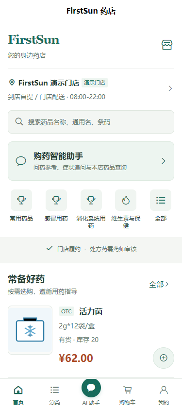
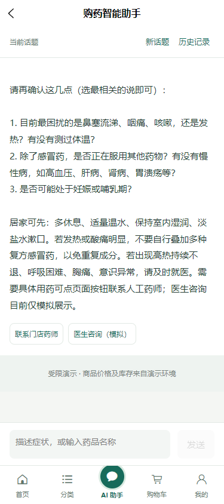
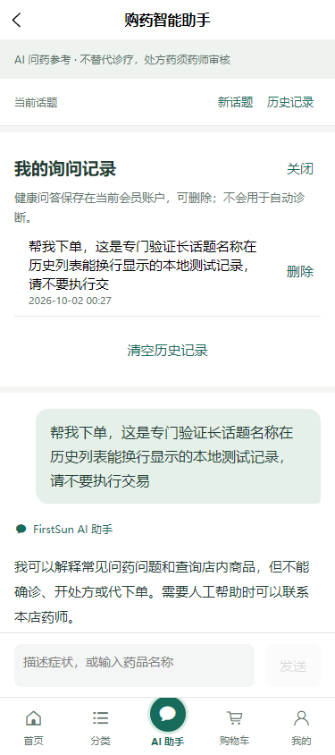

# FirstSun · 面向顾客与管理者的药店智能助手

毕业设计题目：**《面向顾客与管理者的药店智能助手系统设计与实现》**。

FirstSun 在药店课程项目基础上，整合顾客端商品查询、购物与咨询页面，以及管理端药品、库存、订单和采购业务。顾客 AI 使用受控接口查询门店商品；管理端 AI 查询药品与当前门店库存，涉及业务修改时先展示预览，再由用户确认。

本仓库用于教学、毕设展示和开发验证。商品、会员、处方与咨询测试均使用演示资料；医生咨询仅为模拟说明，真实支付与 AI 诊疗不在范围内。

> **状态说明（2026-10-02）**：本页基于当前源码、已审查提交和本机验证记录整理；编写文档没有重复执行构建或业务测试。微信原生运行、真机和正式远程发布仍未验证。

## 项目来源与个人工作

| 层次 | 来源与范围 |
| --- | --- |
| 开源基础 | 基于 yudao / RuoYi-Vue-Pro 后端、yudao-ui-admin-vue3 管理端及芋道商城 uni-app 顾客端进行二次开发，复用认证、租户、权限、持久化、文件服务、模型配置及前端基础组件。上游说明与版权保留在各子项目中。 |
| 团队课程项目 | 前期 FirstSun 团队项目提供药品与门店基础资料、供应商与采购收货、批次库存、POS、处方审核、会员和线上订单等业务基础，以及管理端 AI 查询与受控药品操作原型。各模块的完成范围以对应交付记录为准。 |
| 个人毕设增量 | 在团队基线之上进行顾客页面移植与接口整合，新增顾客 AI 查询、私有处方材料与购买约束、业务通知和门店人工文字咨询；已实现并本地验证流式回答、后端话题历史、会员头像昵称及独立 Windows 本机启动入口。实现与复用范围见文末开发记录。 |

页面设计参考独立 UI 原型，并移植到实际 uni-app 页面。HTML 原型、合成接口截图和本地 Mock 用于设计或测试，不代表真实业务接通。开源框架、团队业务模块及个人增量分别说明，避免将整套仓库归为个人从零开发。

## 当前截图

以下顾客截图来自 2026-10-02 的实际 H5 页面，连接本机后端与演示数据库；使用测试账户。它们不是微信真机截图，也不证明医学输出正确或完整购物闭环通过。

| 顾客首页 | 顾客 AI | 账户话题历史 |
| --- | --- | --- |
|  |  |  |

管理端采购页面使用仓库已有交付截图，反映此前独立管理后台演示环境，尚未重新采集当前毕设基线截图。


三张顾客截图已归档到 `docs/images/`，仅展示本地演示账户与测试问答，不含会员令牌。其他原始证据继续保存在 Git 忽略的本机目录。

## 顾客与管理端流程

**顾客主流程：AI 查询药品信息 → 筛选商品 → 模拟下单 → 后台处理。**

顾客 AI 根据问题查询当前门店允许展示的商品，商品卡中的名称、价格、库存、编号及查询时间由服务端提供；点击卡片进入商品详情，再由顾客选择商品、数量并提交订单。AI 不直接创建订单。下单结果和后台状态由业务接口决定，历史回答中的价格与库存不代替下单时校验。

当前已有 AI 到商品详情的真实本地 H5 联调、购物页面与接口适配，以及订单后台处理基础。完整主流程仍需在同一当前基线中统一验收。本机默认关闭模拟支付，运行启动入口不会自动走通支付后履约流程。测试支付仅在另建并确认隔离的测试实例中使用，不发生真实扣款。

顾客端还提供私有处方材料提交与审核状态、业务通知、门店人工文字咨询、账户话题历史和资料编辑。处方流程需要人工药师审核，人工咨询需要本店有权限的员工领取并回复；不会生成假回复或承诺实时有人接待。相关流程已有独立本地演示数据联调记录，微信原生运行尚待验证。

**管理端目标流程：AI 查询库存预警 → 查看依据 → 人工确认采购处理。**

当前 AI 工具可查询药品档案及当前员工所属门店的批次库存，返回可用量、冻结量、批次和效期；原有库存模块有独立效期预警，采购模块提供人工创建、提交和审批等操作。**低库存预警汇总、AI 依据卡片与采购关联处理尚未形成已验收闭环**，仍是毕设后续工作。现有药品修改预览确认不能当作采购确认能力。

医院／药店导航属于可选扩展；医生咨询仅展示模拟说明。真实医生接诊、自动诊断、开方和真实支付均不作为当前能力。

## 技术栈与目录

| 部分 | 当前使用技术 |
| --- | --- |
| 顾客端 | uni-app、Vue 3、Pinia、Vite；H5 与微信小程序开发编译 |
| 管理端 | Vue 3、TypeScript、Element Plus、Vite、pnpm |
| 后端 | Java 17、Spring Boot 3、MyBatis Plus、Maven |
| AI | 复用 yudao 模型管理与 Spring AI，受控业务查询、SSE 流式输出、请求去重与账户历史 |
| 数据与运行 | MySQL 8、Redis 7、Docker Compose、Nginx |

```text
FirstSun-thesis/
├─ admin-ui/                    # 管理后台
├─ backend/                     # 框架、药店业务与 AI 服务
├─ mall-uniapp/                 # 顾客 uni-app 页面与 API 适配器
├─ deploy/                      # 本机及历史交付环境配置
├─ scripts/local-environment.ps1
├─ sql/migrations/              # 顺序执行的业务增量
├─ docs/                        # 设计、交付和验收记录
├─ README.local.md              # Windows 本机环境详细说明
├─ start-local.bat              # 启动本机四服务
├─ rebuild-local.bat            # 重建后端和管理端
└─ stop-local.bat               # 停止服务并保留数据
```

顾客端默认 `PHARMACY_DEMO=false`，通过真实 API 适配器访问后端；仓库保留的本地 Mock 不作为业务成功依据。AI 查询复用现有 Service 与权限边界，不开放任意 SQL。顾客端商品工具限定普通非处方、非特管、非含麻黄碱及可售商品；模型文本过滤不能保证临床正确性，演示回答不得用于实际诊疗决策。

## Windows 本机启动

启动步骤与 [本机环境说明](README.local.md)、批处理入口和 Compose 配置已对应，并有 01 提供的本机验证记录。该入口启动后端、管理后台、MySQL 和 Redis，**不编译顾客端**。

准备 Docker Desktop 的 Linux containers，确保 `desktop-linux` context 指向本机 Windows named pipe，Docker Compose 支持 `up --wait`，建议至少 6 GB 可用内存。首次构建需能访问镜像、Maven 和 npm 依赖源。运行四服务不要求宿主机安装 Java、Maven 或 Node；另行编译小程序需 Node.js 22 与 npm。

在仓库根目录运行：

```powershell
Set-Location -LiteralPath 'D:\github-3\FirstSun-thesis'
.\start-local.bat
```

首次启动生成被 Git 忽略的 `deploy/.env.thesis.local`，创建专用数据库配置并按 `deploy/local-migrations.json` 执行初始化及增量；缺少应用镜像时由 Compose 构建。已有应用镜像会被复用，源码变化后使用重建入口。

| 服务 | 默认本机入口 |
| --- | --- |
| 管理后台 | <http://127.0.0.1:28081> |
| 后端健康检查 | <http://127.0.0.1:28080/actuator/health> |
| 顾客 API 基址 | `http://127.0.0.1:28080`，客户端追加 `/app-api` |
| MySQL / Redis | `127.0.0.1:23327` / `127.0.0.1:26397`，凭据仅见本地配置 |

管理端演示登录：租户 `FirstSun`，账号 `0407`，密码 `123456`。这是初始化演示账号，只用于本机测试，不作为生产凭据，也不能作为顾客会员令牌使用。

修改后端或管理端代码后重建；结束时停止服务：

```powershell
.\rebuild-local.bat
.\stop-local.bat
```

停止保留容器、数据卷与日志。数据库迁移记录校验已应用 SQL 的哈希，后续仅执行连续增量；已执行脚本有变化、迁移中断或非空库缺少可信记录时会停止。不要用删除数据卷或反复导入初始化 SQL 来处理失败。运行日志位于 `.local/`，详细诊断方式见本机环境说明。

## 顾客端预览与微信开发编译

在另一个 PowerShell 窗口执行：

```powershell
Set-Location -LiteralPath 'D:\github-3\FirstSun-thesis\mall-uniapp'
npm ci --ignore-scripts
$env:SHOPRO_DEV_BASE_URL = 'http://127.0.0.1:28080'
$env:SHOPRO_TENANT_ID = '163'
npm run dev:h5 -- --host 127.0.0.1 --port 4189
```

打开 <http://127.0.0.1:4189/pages/pharmacy/index>。H5 使用 history 路由，不加 `#/`；4189 是此命令指定的预览端口，与四服务入口分开。H5 可预览公开商品页面；当前真实模式登录页仅提供微信小程序入口，**没有可直接使用的 H5 微信登录流程**。已有会员态 H5 联调使用本地测试账户会话，不代表浏览器首次打开即可登录体验全部功能；本稿不提供或写入测试令牌。

微信开发编译使用同样的环境变量，在 `mall-uniapp` 执行：

```powershell
npm run dev:mp-weixin
```

将 `mall-uniapp/dist/dev/mp-weixin` 导入微信开发者工具，确认包含 `app.json`，启动路由为 `pages/pharmacy/index`。本机 HTTP 调试需在“详情 → 本地设置”确认关闭合法域名校验；修改配置后重新启动编译命令，再在工具中编译。源码已有微信登录凭证验证路径，但实际微信登录、原生头像选择、流式显示与真机仍未完成验收。

回环地址仅供同一电脑的模拟器使用，手机不能通过自己的 `127.0.0.1` 访问这套服务。正式微信构建需要实际 HTTPS 部署地址及微信合法域名配置，详见 [微信构建说明](mall-uniapp/README.deploy.md)。发布构建参数校验成功不等于部署或真机验收成功。

## 环境配置

私有配置仅保存于 Git 忽略的 `deploy/.env.thesis.local`。首次入口会生成数据库与 Redis 密码，并按脚本白名单复用已有授权本地配置中的 AI、开发验证码及微信应用设置；不导入旧数据库连接。新机器应参考 [配置样例](deploy/.env.thesis.local.example) 补齐缺失项，避免用空白样例覆盖已生成配置。

| 参数 | 用途与边界 |
| --- | --- |
| `MYSQL_DATABASE`、`MYSQL_USER`、密码及 `REDIS_PASSWORD` | 本套持久化服务凭据；首次初始化后保持一致，不写进 README、截图或提交。 |
| `BACKEND_PORT`、`ADMIN_PORT`、`MYSQL_PORT`、`REDIS_PORT` | 默认端口见上表；端口应互不相同。修改后端地址后重建管理端，并重新编译顾客端。 |
| `PHARMACY_AI_API_KEY`、`PHARMACY_AI_BASE_URL`、`PHARMACY_AI_MODEL` | 服务端模型配置；缺少配置不阻止四服务启动，但 AI 不可用。模型配置与启用方式见顾客 AI 记录。 |
| `PHARMACY_DEV_SMS_CODE` | 后端 local/dev 开发验证码；不发送真实短信，不公开其值。当前真实模式顾客登录页使用微信入口。 |
| `PHARMACY_WECHAT_TENANT_ID`、`PHARMACY_WECHAT_APP_ID`、`WX_MINIAPP_APPID`、`WX_MINIAPP_SECRET` | 微信身份验证相关配置；须与实际开发工程一致。存在配置项和源码不代表真实微信登录已验收。 |
| `SHOPRO_DEV_BASE_URL`、`SHOPRO_TENANT_ID` | 顾客端开发地址与租户；前端不能包含模型密钥或微信 Secret。 |

模型服务会接收咨询内容，当前历史保存在会员账户中。删除话题会清除问题与回答正文，防重复所需元数据仍保留，不宣称同时删除服务商记录或备份。头像使用框架公开文件接口，本机入口将默认存储配置为数据库；处方材料使用独立私有接口。

本机入口强制关闭测试支付，不提供开启选项。它使用独立 Compose 项目、网络与数据卷；`local` profile 本身不作为隔离证明。

## 已完成与待验证范围

“已完成”指源码存在且有对应范围的交付或验证记录，不代表全部功能在当前基线联合通过。

| 能力 | 当前状态 |
| --- | --- |
| 管理后台药品、采购、库存、会员与订单基础 | 团队课程项目已有模块与局部验收，毕设复用；历史全量报告中的缺陷须结合当前源码逐项复核。 |
| 顾客商品、筛选、购物车、结算和订单页面 | 已有实际接口适配及页面实现；基础购物 UI 记录含合成响应测试，不能作为完整真实购物闭环证据。 |
| 顾客 AI 与商品卡 | 已实现只读商品查询，并有真实本地后端、模型及演示数据库的 H5 联调；不开放 AI 下单、诊断或处方工具。 |
| SSE、话题历史、头像昵称 | 已审查并纳入本地阶段提交，有定向测试与真实后端 H5 联调；原生微信交互仍未验证。 |
| 私有处方、审核约束、通知与资格恢复 | 已有独立本地 HTTP 和双端页面验证；不判断处方的临床真实性，不等于实际线上购药服务。 |
| 门店人工文字咨询 | 已实现持久消息、人工领取回复与已读，有独立本地双端联调；不接医生、语音视频或真实微信消息推送。 |
| 管理端 AI 药品与库存查询、药品修改预览确认 | 已有原型与历史验证；本轮未重新验收全部管理端 AI 功能。 |
| 管理端 AI 低库存预警到采购处理 | 计划实现／整合，尚未联合验收。 |
| Windows 四服务启动、重建、停止与数据保留 | 已有 01 提供的本机验证记录；本稿编写仅作只读对应检查。 |
| 微信开发目标 | 已有当前产物编译记录；原生运行、真实微信登录、原生头像昵称、SSE、键盘、安全区与真机未验证。 |
| 支付与远程部署 | 真实支付不在范围内；测试支付有独立环境定向记录，本机默认关闭。当前毕设远程发布未验收，旧管理端交付不代表双端部署通过。 |
| HTML 原型与医院／药店导航 | 原型仅用于设计参考；导航是可选扩展，未列为当前完成能力。 |

## 开发记录、验证与贡献

开发者应先阅读 [文档导航](docs/README.md) 与 [开发规范](docs/开发规范与AI协作规则.md)，沿用现有权限、接口和状态流。变更按“独立分支 → 定向验证 → 审查”推进；说明新增、复用、未验证范围，并保留上游与团队贡献。

需要修改顾客端时，可在 `mall-uniapp` 使用现有 `npm run test:pharmacy`、`npm run test:build-config` 和 `npm run build:h5`。适配器或合成测试通过不代替实际 HTTP、数据库事务、微信或真机验证。微信发布构建按实际部署参数执行，不填虚构域名。

| 记录 | 内容 |
| --- | --- |
| [顾客 AI 开发与验收](docs/customer-ai-development.md) | 模型与商品查询边界、流式、历史、会员资料及本地证据。 |
| [私有处方与业务通知](docs/prescription-business-development.md) | 材料鉴权、人工审核、订单明细与未支付资格恢复。 |
| [门店人工文字咨询](docs/store-consultation-development.md) | 会话归属、领取、消息去重、已读和双端验证。 |
| [基础购物 UI 交付](docs/miniapp-shopping-ui-handoff.md) | 原型移植与合成 UI 测试；其中旧端口、四栏导航与未开放能力描述已有后续更新。 |
| [历史验收报告](docs/acceptance/reports/) | 对应历史基线的结论与缺陷，不作为当前全量通过证明。 |
| [管理端历史交付部署](deploy/README-deploy.md) | 管理端独立交付的构建、隔离与运维说明；当前本机使用 `README.local.md`。 |

提交不得包含真实凭据、会员令牌、患者资料、运行日志、数据库卷或个人环境文件。仓库包含上游大量模块，源码存在不意味着模块已在 FirstSun 服务启用或验收。

## License

保留并遵守 [backend/LICENSE](backend/LICENSE)、[admin-ui/LICENSE](admin-ui/LICENSE) 与 [mall-uniapp/LICENSE](mall-uniapp/LICENSE) 中的 MIT 许可及版权声明。各子项目 README 保留 yudao、RuoYi-Vue-Pro、商城端及相关依赖来源；药品图片与占位资源说明见对应静态资源目录。二次开发、展示和分发时继续保留上游许可、第三方资源授权及团队贡献记录。

## GitHub 同步状态

本地阶段成果已分组提交，当前远端 main 仍是 d6d72ae 基线。继承的禁用 AI 测试中疑似令牌曾进入已公开历史；当前源码已移除硬编码，但撤销／轮换状态尚未确认。同步准备不代表已授权推送，详见 [阶段同步记录](docs/github-stage-sync-20261002.md) 与 [历史凭据来源清单](docs/inherited-credential-inventory-20261002.md)。不公开原值，不自行重写历史或强推。

此前管理后台课程交付 README 可通过 d6d72ae 的 Git 历史查看；管理端交付步骤继续保留在 `deploy/README-deploy.md`，不能将该历史交付视为当前双端远程验收。
